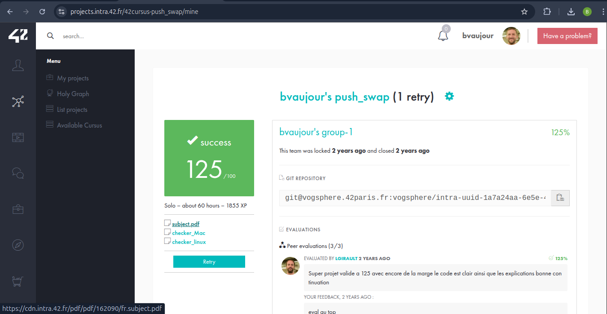

# push_swap
[Voir le sujet](./subject.pdf)

Projet de niveau 3 de l'école 42.

La pile A contiendra tous les nombres passés en argument à l'executable, la pile B servira d'espace libre pour permettre les operations de rangement.

Implémentation d’un algorithme de tri pour une pile d’entiers, avec un nombre d’opérations minimal, en utilisant uniquement les opérations `push` (passer un entier de la pile A à la pile B, ou inversement), `swap` (echanger les deux premiers entiers de la pile A ou de la pile B), `rotate` (echanger la place de tous les entiers de la pile A ou de la pile B) et `reverse_rotate` (echanger la place de tous les entiers de la pile A ou de la pile B en sens inversé).

Utilisation:

./push_swap 125 30 86 45 62 35 20 58

